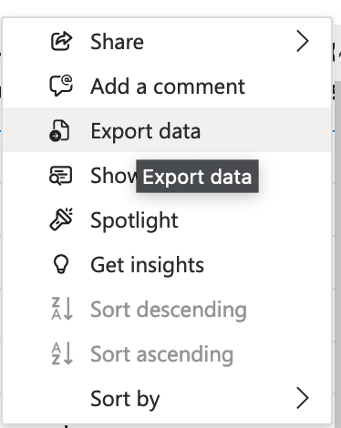

# Pretty Unit Capability Analysis

This is a Python project that takes a CSV file of qualifications and generates a visually appealing report.

It requires you have an export of data or access to the relevant PowerBI reports to generate an export of the data.

If you don't know what this means, then this repository is probably not for you.

## Installation

1. Clone this repository to your local machine
2. Install Python 3
3. Install Poetry package manager for Python
4. Navigate to the project directory in your terminal
5. Run `poetry install` to install the project dependencies

## Usage

1. In the terminal, navigate to the project directory
2. Run the command `poetry run python main.py`
3. You will be prompted for the path of your qualifications CSV file
4. A visual report will be generated and saved in the output folder

## Options
You can use the following command-line options to configure the running of the application:

`-p --path`: Path of the input CSV file\
`-o --output`: Filename for the generated html report

## Exporting Capability Data

1. Visit the [Member Capability - Matrix View Report](https://app.powerbi.com/Redirect?action=OpenReport&appId=e6ca8a3a-3c51-4a52-b491-9094b5f1f279&reportObjectId=e506320e-c81a-4952-820f-057db84996cd&ctid=d131eb12-43fc-4274-a9d2-9955727fe3af&reportPage=ReportSectione6432d00508440b7a3a0&pbi_source=appShareLink&portalSessionId=869d149c-17ea-4583-9058-31348d7609c8) *(You will need to be an authorised user to do this)*
2. Filter the report to your required unit and adjust **Capability Status** to be Achieved & Expired
3. In the top right hand corner of the report box, press the three dots (`More Options`) button and choose `Export Data`

4. Choose `Summarised Data`
5. Save the generated Excel file locally, remove the first **two** rows, and save as a **CSV**

## Acknowledgements

Lorem ipsum

## License

This project is licensed under the MIT License. Feel free to modify and use the code for your own purposes.
